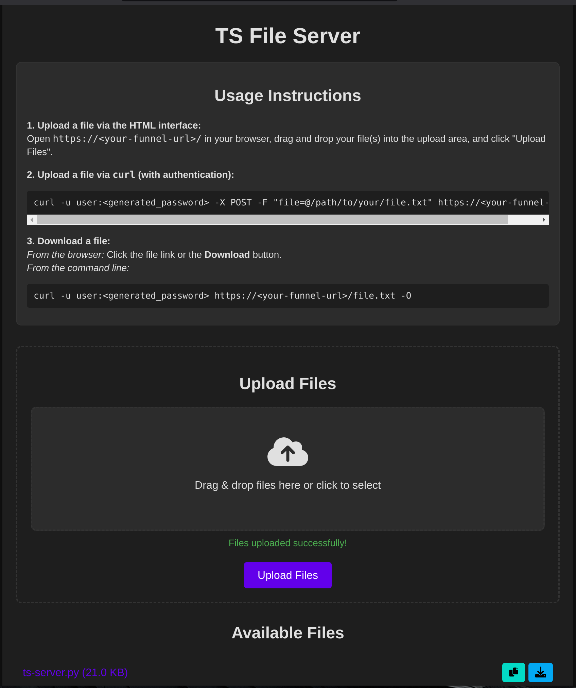

```
 _____ ____        ____
|_   _/ ___|      / ___|  ___ _ ____   _____ _ __
  | | \___ \ _____\___ \ / _ \ '__\ \ / / _ \ '__|
  | |  ___) |_____|___) |  __/ |   \ V /  __/ |
  |_| |____/      |____/ \___|_|    \_/ \___|_|
```

# TS-Server

**Secure file sharing and uploads over Tailscale Funnel**

A lightweight file server exposing your local directories to the internet via Tailscale's secure network. Available in both Python and Go implementations.



## Available Versions

| Version | Best For | Size | Dependencies |
|---------|----------|------|--------------|
| **[Python](#python-version)** | Quick setup, already have Python/Tailscale | ~10KB script | Python 3.6+, Tailscale daemon |
| **[Go](#go-version)** | Cross-platform binary, multi-system deployment | 26MB binary | None (self-contained) |

**Quick Start:**
```bash
# Python (requires Tailscale daemon)
sudo python3 ts-server.py --dir ~/files

# Go (self-contained binary)
./ts-server --dir ~/files
```

**[→ Python Documentation](#python-version)** | **[→ Go Documentation](#go-version)** | **[→ Authentication Setup](#authentication-setup)**

## Core Features (Both Versions)
- **Enhanced File Sharing & Uploads:**
  - Serve files from any directory using Python’s built-in HTTP server.
  - Upload files via an intuitive HTML interface that supports drag & drop, multiple file selection, and real-time progress updates.
- **Secure Public Access via Tailscale Funnel:**
  - Expose your server safely to the internet using **Tailscale Funnel**.
- **Optional Basic Authentication:**
  - Protect your server with HTTP Basic authentication. When enabled, a random password is generated at startup.
- **JSON File Listing API:**
  - Access a JSON-formatted list of files (name and size) by visiting the `/list` endpoint.
- **Customizable:**
  - Easily set the port and the directory to serve/upload files from.

---

# Python Version

```
┌─────────────────────────────────────────────────────────────────┐
│ Lightweight script using system Tailscale daemon               │
└─────────────────────────────────────────────────────────────────┘
```

The Python version is a lightweight script that uses your system's Tailscale installation.

## Prerequisites
Ensure you have the following installed and set up:
- **Python 3.6+** (Compatible with Python 3.11+ / 3.13+ - no deprecated dependencies)
- **Tailscale** with **Tailscale Funnel** enabled.  
  _Tip: If you prefer not to run as root, run Tailscale as a non-root operator (e.g., `tailscale up --operator=$USER`)._

## Installation (Python)

1. **Clone the repository** or download the `ts-server.py` script.
2. Make sure you have **Python 3.6 or later** installed.
3. Install and configure **Tailscale** on your system.

## Usage (Python)

Run the script from any directory:

```bash
sudo python3 ts-server.py [port] [--auth] [--dir PATH]
```

- **`[port]` [optional]:** Port to run the server on (default: 8080).
- **`--auth` [optional]:** Enable basic authentication. When used, the server will generate and display a random password.
- **`--dir PATH` [optional]:** Specify the directory to serve and save files (default: current directory).

### Example Scenarios

1. **Serve the current directory** on the default port (8080):
   ```bash
   sudo python3 ts-server.py
   ```

2. **Serve files from a custom directory** (e.g., `/home/user/Documents`) on a specific port (9000):
   ```bash
   sudo python3 ts-server.py 9000 --dir /home/user/Documents
   ```

3. **Enable basic authentication** (serving the current directory):
   ```bash
   sudo python3 ts-server.py --auth
   ```
   On startup, the terminal will display something like:
   ```bash
   [INFO] Serving directory: /current/directory
   [INFO] Generated credentials - Username: user, Password: SPx8gDJdTVvp
   [INFO] Available on the internet:
   [INFO]
   [INFO] https://your-funnel-url.ts.net/
   [INFO] Share this link: https://your-funnel-url.ts.net/
   [INFO] ==================================================
   [INFO] Server Information:
   [INFO] --------------------------------------------------
   [INFO] Directory: /current/directory
   [INFO] Port: 8080
   [INFO]
   [INFO] Authentication Required:
   [INFO] --------------------------------------------------
   [INFO] Username: user
   [INFO] Password: SPx8gDJdTVvp
   [INFO] ==================================================
   
   ```

---

## Web Interface & API Endpoints

### HTML Upload Page
- **Access:** Open `https://<your-funnel-url>/` in your browser.
- **Features:**
  - Drag & drop file uploads.
  - Multiple file selection.
  - Real-time upload progress.
  - Dynamic refresh of the file list.

### JSON File Listing
- **Endpoint:** `https://<your-funnel-url>/list`
- **Response:** A JSON array where each object contains the `name` and `size` (in bytes) of a file.

### File Download
- Download files by clicking on the file links in the HTML interface or directly visiting `https://<your-funnel-url>/<filename>`.

---

## Uploading Files via Command Line

You can upload files using `curl` as well:

#### With Authentication:
```bash
curl -u user:<generated_password> -X POST -F "file=@/path/to/your/file.txt" https://<your-funnel-url>/
```

#### Without Authentication:
```bash
curl -X POST -F "file=@/path/to/your/file.txt" https://<your-funnel-url>/
```

---

## Authentication

When you launch the server with the `--auth` flag, it generates a random password and requires basic authentication:
- **Username:** user
- **Password:** (Displayed in the terminal on startup)

---

## Stopping the Server

To stop the HTTP server and the Tailscale Funnel process, press `Ctrl + C` in the terminal where the server is running. This will gracefully terminate both the server and the funnel.

---

## Security Considerations

- **Authentication:** Enable basic authentication when sharing sensitive or private files.
  - Uses constant-time comparison to prevent timing attacks
  - Generates cryptographically secure random passwords
- **HTTPS:** While Tailscale Funnel secures the connection, keep in mind that Basic Authentication transmits credentials in Base64. Use it within trusted networks or over HTTPS.
- **Filename Sanitization:** Uploaded filenames are comprehensively sanitized to prevent:
  - Directory traversal attacks (../../../etc/passwd)
  - Dangerous characters (<>:"/\|?*)
  - Hidden files and reserved system names
  - Empty or malformed filenames
- **Security Headers:** Implements multiple security headers:
  - X-Content-Type-Options: nosniff
  - X-Frame-Options: DENY  
  - X-XSS-Protection: 1; mode=block
  - Referrer-Policy: strict-origin-when-cross-origin
- **Error Handling:** Prevents information disclosure through sanitized error messages
- **Content Control:** Only serve directories and files that you trust.

---

## Testing

### Running Tests

The project includes a comprehensive test suite to verify security features and functionality:

```bash
# Install test dependencies
pip3 install -r requirements-dev.txt

# Run all tests
python3 -m pytest tests/ -v

# Run with coverage report
python3 -m pytest tests/ -v --cov=ts-server.py --cov-report=html
```

### Test Coverage

The test suite covers:
- **Authentication security**: Timing attack resistance, credential validation
- **Filename sanitization**: Path traversal prevention, dangerous character handling
- **Security headers**: XSS protection, clickjacking prevention  
- **Input validation**: Malformed requests, edge cases
- **Core functionality**: File listing, directory handling

### Security Testing

Key security tests include:
- Path traversal attack prevention (`../../../etc/passwd`)
- Dangerous character sanitization (`<>:"/\|?*`)
- Authentication timing attack resistance
- Hidden file protection
- Reserved filename handling

---

## Troubleshooting

- **Tailscale Funnel Issues:**  
  Ensure Tailscale Funnel is active and properly configured.
- **Authentication Errors:**  
  Double-check that you’re using the correct generated password.
- **File Upload Failures:**  
  Verify that your file upload requests are encoded as `multipart/form-data`.

---

## Global Installation (Optional)

To run the script from anywhere on your system:

1. Create a symbolic link to the script:
   ```bash
   sudo ln -s /path/to/ts-server.py /usr/local/bin/ts-server
   ```
   Then use:
   ```bash
   sudo ts-server [arguments]
   ```

2. Alternatively, add the script’s directory to your system PATH by adding the following line to your `.bashrc` or `.zshrc`:
   ```bash
   export PATH=$PATH:/path/to/your/scripts
   ```

---

## Additional Resources

- [Tailscale Funnel Documentation](https://tailscale.com/kb/1223/tailscale-funnel/)
- [Python HTTP Server Documentation](https://docs.python.org/3/library/http.server.html)

---

### Example Full Workflow

1. **Start the server with authentication:**
   ```bash
   sudo python3 ts-server.py --auth
   ```
   The terminal will display:
   ```
   [INFO] Serving directory: /current/directory
   [INFO] Generated credentials - Username: user, Password: SPx8gDJdTVvp
   [INFO] Available on the internet:
   [INFO]
   [INFO] https://your-funnel-url.ts.net/
   [INFO] Share this link: https://your-funnel-url.ts.net/
   [INFO] ==================================================
   [INFO] Server Information:
   [INFO] --------------------------------------------------
   [INFO] Directory: /current/directory
   [INFO] Port: 8080
   [INFO]
   [INFO] Authentication Required:
   [INFO] --------------------------------------------------
   [INFO] Username: user
   [INFO] Password: SPx8gDJdTVvp
   [INFO] ==================================================
   ```

2. **Upload a file via the HTML interface:**
   - Open `https://<your-funnel-url>/` in your browser.
   - Drag and drop your file(s) into the upload area and click "Upload Files".

3. **Upload a file via `curl` (with authentication):**
   ```bash
   curl -u user:<generated_password> -X POST -F "file=@/path/to/your/file.txt" https://<your-funnel-url>/
   ```

4. **Download a file:**
   - From the browser: Click the file link in the HTML interface.
   - From the command line:
     ```bash
     curl -u user:<generated_password> https://<your-funnel-url>/file.txt -O
     ```

---

# Go Version

```
┌─────────────────────────────────────────────────────────────────┐
│ Self-contained binary with embedded Tailscale (tsnet)          │
│ No external dependencies required                              │
└─────────────────────────────────────────────────────────────────┘
```

**[→ Full Go Documentation](README-GO.md)**

## Quick Start (Go)

```bash
# Switch to Go branch
git checkout feature/go-tsnet-rewrite

# Build (requires Go 1.21+)
go build -ldflags="-s -w" -o ts-server

# Run with OAuth (recommended)
export TS_OAUTH_CLIENT_ID=your-client-id
export TS_OAUTH_CLIENT_SECRET=your-client-secret
./ts-server --dir ~/files

# Or run with auth key
TS_AUTHKEY=tskey-auth-xxx ./ts-server --dir ~/files
```

## Key Differences

| Feature | Python Version | Go Version |
|---------|----------------|------------|
| **Dependencies** | Python + Tailscale daemon | None (single binary) |
| **Platforms** | Any with Python | Linux, macOS, Windows, ARM, BSD |
| **Binary Size** | N/A | 26MB (stripped) |
| **Tailscale Setup** | System installation required | Embedded (tsnet) |
| **OAuth Support** | No | Yes |
| **Root Required** | Yes (for funnel) | No |
| **Deployment** | Copy script + install deps | Copy single binary |

## Why Choose Go Version?

- **Cross-platform binaries** for Windows, macOS, Linux, ARM
- **No Tailscale installation needed** - tsnet is embedded
- **OAuth authentication** - easier multi-system deployment
- **No sudo required** - tsnet handles privileged ports
- **Colored terminal output** with ASCII art
- **HTTP access logs** with IP, method, status codes

---

# Authentication Setup

```
┌─────────────────────────────────────────────────────────────────┐
│ Three methods: OAuth (Go only) | Auth Keys | Interactive Login │
└─────────────────────────────────────────────────────────────────┘
```

Both versions support Tailscale authentication. The Go version also supports OAuth for easier multi-system deployments.

## Option 1: OAuth Client (Go Only - Recommended for Multiple Systems)

OAuth credentials work across all your systems without copying keys around.

### Setup OAuth

1. **Create OAuth Client:**
   - Visit: https://login.tailscale.com/admin/settings/oauth
   - Click "Generate OAuth client"
   - **Scopes:** `devices:write`
   - **Tags:** `tag:fileserver` (create if doesn't exist)
   - Copy **Client ID** and **Client Secret**

2. **Configure Environment Variables:**
   ```bash
   # Add to ~/.bashrc or ~/.zshrc
   export TS_OAUTH_CLIENT_ID=k123abc...
   export TS_OAUTH_CLIENT_SECRET=tscs-k456def...
   ```

3. **Run on Any System:**
   ```bash
   # Go version will automatically use OAuth credentials
   ./ts-server --dir ~/files
   ```

**Benefits:**
- Same credentials work on all systems
- Centrally revokable from Tailscale admin
- Auto-generates ephemeral auth keys
- No manual key management

## Option 2: Auth Key (Both Versions)

Auth keys are simpler but need to be copied to each system.

### Generate Auth Key

1. **Create Key:**
   - Visit: https://login.tailscale.com/admin/settings/keys
   - Click "Generate auth key"
   - **Options:**
     - Reusable: Yes (if using on multiple systems)
     - Ephemeral: Yes (recommended - auto-cleanup)
     - Expiration: 90 days (or custom)
   - Copy the generated key

2. **Use the Key:**

   **Python version:**
   ```bash
   # Tailscale must already be running on the system
   # Auth key is not needed - uses system Tailscale
   sudo python3 ts-server.py --dir ~/files
   ```

   **Go version:**
   ```bash
   TS_AUTHKEY=tskey-auth-xxx ./ts-server --dir ~/files
   ```

**Limitations:**
- Must copy key to each system
- Keys expire (1-90 days)
- No central revocation (must delete from admin panel)

## Option 3: Interactive Login (Go Only)

No credentials needed - just click a link.

```bash
# Run without any auth
./ts-server --dir ~/files

# Output will show:
# [*] To authenticate, visit: https://login.tailscale.com/a/xyz123
# Click the link and authenticate in your browser
```

**Best for:**
- Testing/development
- One-time usage
- When you don't have OAuth/auth key set up

---

## Recommendation Matrix

| Your Situation | Use This |
|----------------|----------|
| **Have Python + Tailscale already installed** | Python version with system Tailscale |
| **Need Windows/macOS support** | Go version |
| **Multiple systems, want easy deployment** | Go version + OAuth |
| **Quick one-time file share** | Either version (Python is faster to start) |
| **Don't want to install Tailscale daemon** | Go version (tsnet embedded) |
| **Prefer lightweight scripts** | Python version |
| **Want colored logs and modern UI** | Go version |

---

## Additional Resources

- [Tailscale Funnel Documentation](https://tailscale.com/kb/1223/tailscale-funnel/)
- [Tailscale OAuth Clients](https://tailscale.com/kb/1215/oauth-clients/)
- [Tailscale Auth Keys](https://tailscale.com/kb/1085/auth-keys/)
- [tsnet Documentation](https://tailscale.com/kb/1244/tsnet)
- [Go Version Full Docs](README-GO.md)

---

## Contributing

Contributions welcome! Please test both Python and Go versions if making changes to core functionality.

## License

[Your License Here]
